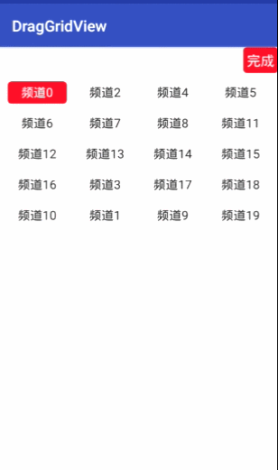

# DragGridView
支持拖动排序的GridView

# 集成
allprojects {
		repositories {
			...
			maven { url 'https://jitpack.io' }
		}
	}

	implementation 'com.github.liuyak:DragGridView:1.0.1'

#使用
package com.liuyk.draggridview.widget;

import android.content.Context;
import android.util.AttributeSet;

import com.drag.draglibrary.BaseDragGridView;
import com.liuyk.draggridview.model.Channel;

/**
 * DESC
 * 

 * Created by liuyakui on 2020/9/17.
 */
public class MyGridView extends BaseDragGridView<Channel> {
    public MyGridView(Context context) {
        super(context);
    }

    public MyGridView(Context context, AttributeSet attrs) {
        super(context, attrs);
    }

    public MyGridView(Context context, AttributeSet attrs, int defStyleAttr) {
        super(context, attrs, defStyleAttr);
    }
}
